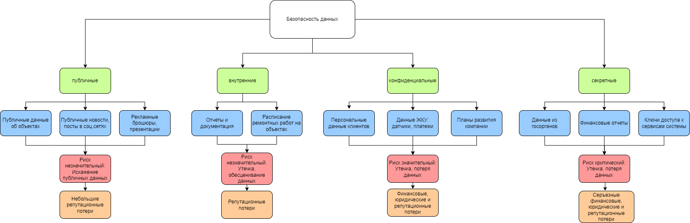

# Задание 1. Разработка проверочного листа по безопасности данных
 
## Классификация данных

### Публичные данные
- публичные данные о доступных объектах недвижимости
- публичные новости о компании
- маркетинговые данные
- рекламные брошюры

### Внутренние данные
- отчеты и документация
- расписание ремонтных работ в домах

### Конфиденциальные данные
- персональные данные клиентов и собственников
- данные ЖКУ: датчики, платежи и т.д.
- планы развития

### Секретные данные
- данные из госорганов
- финансовые отчеты
- ключи доступов к узлам системы

## Анализ рисков

### Публичные данные
- Оценка риска: незначительный
- Риски: искажение публичных данных. Например, взлом аккаунт компании в соц.сети и публикация ложных обещаний, намерений.

### Внутренние данные
- Оценка риска: незначительный
- Риски: утечка данных, обесценивание данных. Например, отчеты и документация важны для работы компании.
- Причины: Утечка таких данных будет иметь низкое воздействие, т.к. не приведет к большим финансовым и репутационным потерям. Однако информация о внутренних процессах может облегчить потенциальные хакерские атаки.

### Конфиденциальные данные
- Оценка риска: значительный
- Риски: утечка или потеря данных
- Причины: утечка этих данных может привести к финансовым, юридическим и репутационным потерям.

### Секретные данные
- Оценка риска: критический
- Риски: утечка или потеря данных
- Причины: утечка этих данных может привести к серъезным финансовым потерям, также это может нанести значительный ущерб репутации.

## Mindmap

