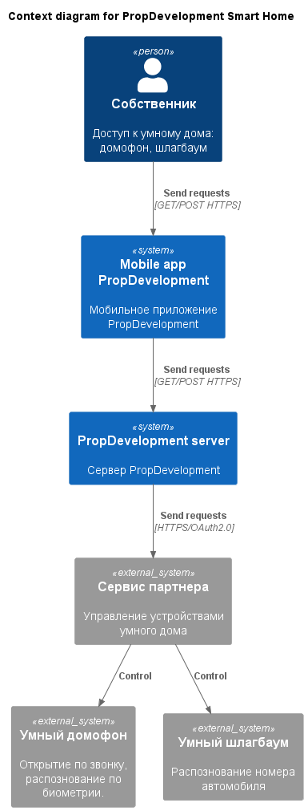
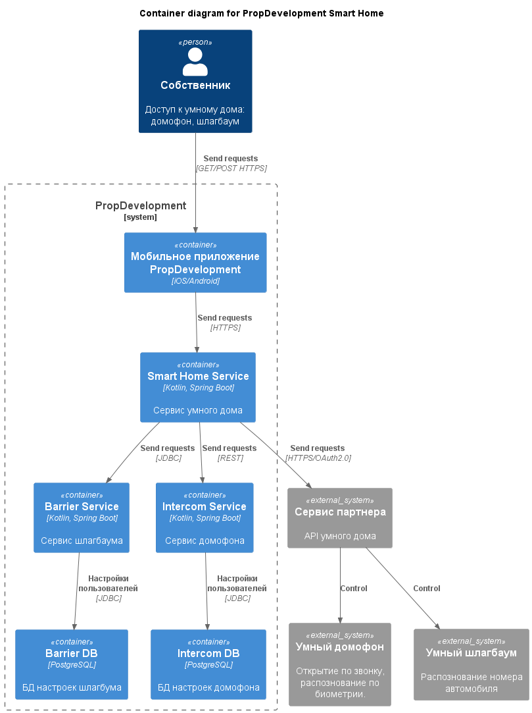
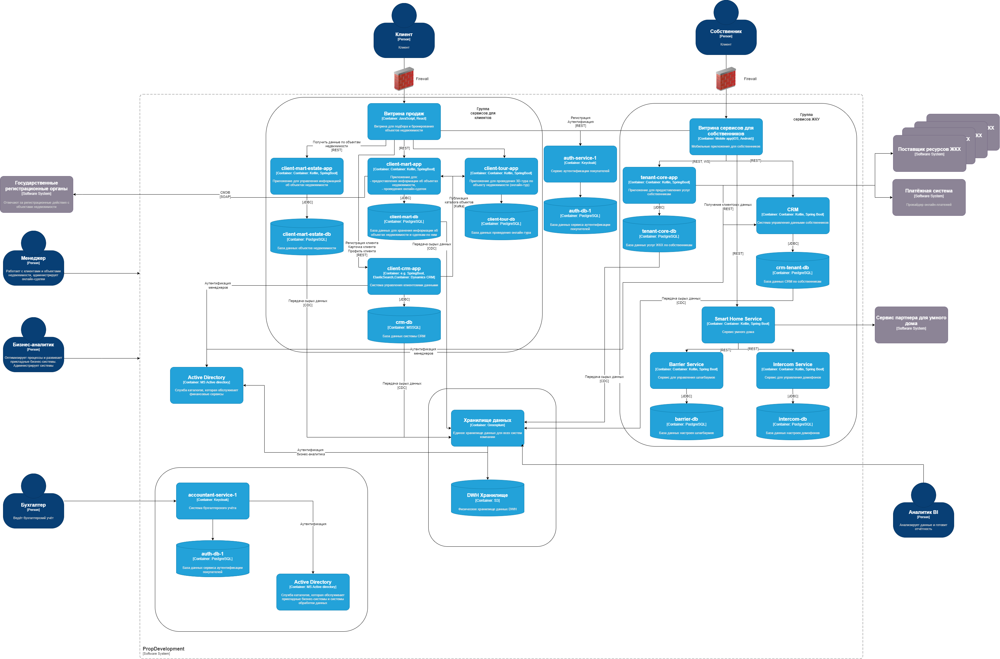

# Задание 3. Внешние интеграции

PropDevelopment хочет расширить бизнес-функции для собственников и жильцов. Компания планирует добавить в систему новые сервисы «Умный дом». Эти сервисы готов предоставить партнёр.

Вы согласовали техническое задание с бизнесом и выбрали две услуги для внедрения:
- Интеллектуальный домофон. Включает функции классического видеодомофона — открытие по звонку. Также есть возможность распознавать пользователей по биометрии (по лицу) и автоматически открывать дверь, если им разрешён доступ в дом.
- Интеллектуальный шлагбаум. Включает функции классического управления шлагбаумом и автоматически открывает доступ, если распознаёт номера автомобилей, которым въезд разрешён.

Новые сервисы должны быть доступны через текущее мобильное приложение, которое используют собственники.

## Решение

### Диаграмма контекста в модели C4

[Диаграмма контекста в модели C4](./context.puml)

### Диаграмма контейнеров в модели C4

[Диаграмма контейнеров в модели C4](./container.puml)

### Диаграмма контейнеров в Drawio

[Диаграмма контейнеров в Drawio](./container-diagram.drawio)

### Список требований, которым должны удовлетворить внешние интеграции

Требования к безопасности
- Передаваемые данные между системой и партнерами должны быть зашифрованы (TLS 1.X+).
- Шифрование биометрическиз данных пользователей.
- Доступ к API должен быть ограничен белым списком.
- Логирование и мониторинг действий пользователей.
- Аудит безопасности партнеров.
- Регулярный аудит прав доступа пользователей.
- Различные права доступа у разных ролей: пользователь, гость, администратор.

Протоколы аутентификации и авторизации
- Использование OAuth 2.0 для взаимодействия между системами.
- Аутентификация пользователей через текущую систему PropDevelopment (Keycloak / Active Directory).

Взаимодействие между системами предприятия и внешней платформой
- Мобильное приложение отправляет запросы к серверу PropDevelopment.
- Сервер взаимодействует с API партнера. Однаков вся логика обработки доступа выполняется на стороне PropDevelopment.
- Сервис умного дома лучше реализовать через микросервисную архитектуру. Создаем отдельный сервис умного дома, которые будет взаимодействовать с конкретными сервисами: домофон, шлагбаум.
- Каждый сервис использует свою собственную базу данных для хранения конфигураций пользователя.
