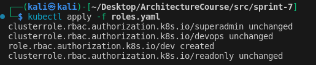
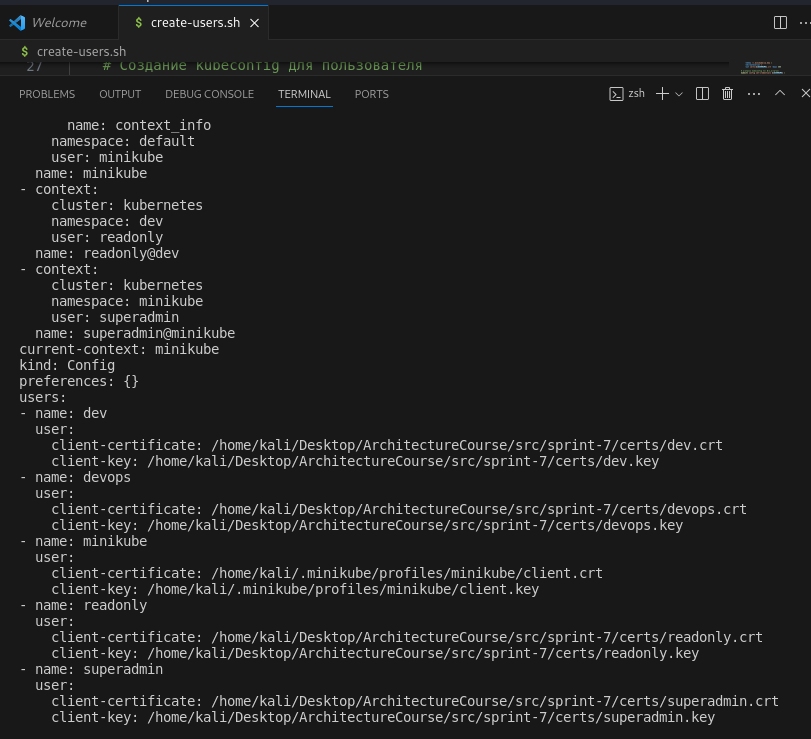
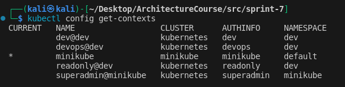
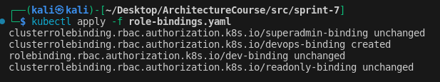
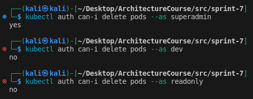

# Задание 4. Защита доступа к кластеру Kubernetes

В этом задании вы поработаете над решением технической задачи. Вам необходимо организовать ролевой доступ к Kubernetes для пользователей кластера.

Вот контекст и факты о ролевой модели:
- Большинство бизнес-сервисов разворачивается в среде Kubernetes. Необходимо ограничить доступ к управлению кластером для различных групп пользователей.
- Необходимо защитить кластер с помощью предоставления привилегированных действий (например, просмотра секретов) для определённых групп пользователей.
- Кроме привилегированных групп пользователей, необходимо выделить ещё минимум две группы пользователей. У первой группы есть право только на просмотр ресурсов кластера. Вторая другая группа пользователей может настраивать кластер.
- Необходимо разграничить доступ к ресурсам кластера, исходя из организационной структуры компании.

### Что нужно сделать

1. Поднимите пустой Minikube. В этот раз вы будете работать без тестового приложения. Изучать код не нужно, поэтому сфокусируйтесь на подготовке скриптов. Они должны будут отражать решения, которые получились у вас по итогу работы над первыми тремя заданиями. Для этого вам понадобится пустой Minikube.
2. Определите все роли и их полномочия при работе с Kubernetes. Мы подготовили шаблон таблицы. Заполните её: укажите там роли, их полномочия и группы пользователей, которые им соответствуют.
3. Подготовьте скрипты для создания пользователей. Рекомендуем создать не менее двух пользователей.
4. Подготовьте скрипты, чтобы создать роли. Они должны соответствовать ролям из вашей таблицы.
5. Подготовьте скрипты, чтобы связать пользователей с ролями.

## Решение

1. Пользователи и роли

| Роль  | Права роли | Группы пользователей |
| --- | --- | --- |
| SuperAdmin | Полный доступ к кластеру | IT administrator: team lead |
| DevOps | Управление деплоями сервисов, конфигов | DevOps engineers |
| Dev | Управление подами, без возможности удаления | Dev engineers |
| ReadOnly | Просмотр ресурсов кластера | Security specialist |

1. Создаем пользователей: создание и аутентификация пользователей выполнено с помощью клиентских сертификатов X.509.

[Смотри скрипт создания пользователей](./create-users.sh)

2. Создаем роли

[Смотри конфигурацию создания ролей](./roles.yaml)

3. Связываем роли с пользователями

[Смотри конфигурацию связывания ролей и пользователей](./role-bindings.yaml)

4. Проверяем, что пользователи имеют правильный доступ, согласно их роли.

- Команда kubectl auth can-i delete pods позволяет выяснить, может ли пользователь выполнить определенное действие.

- kubectl auth can-i delete pods --as dev
Позволяет администратору выдать себя за пользователя, чтобы узнать, может ли тот выполнить определенное действие.

