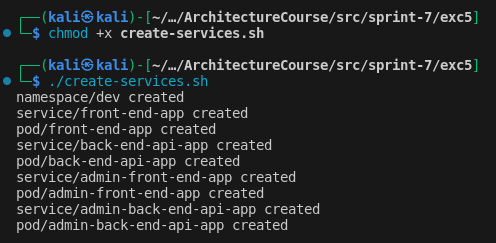
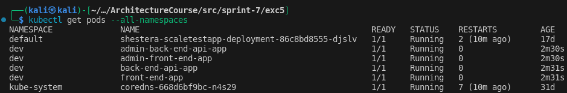
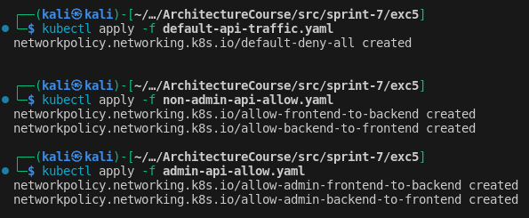
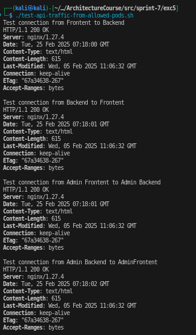
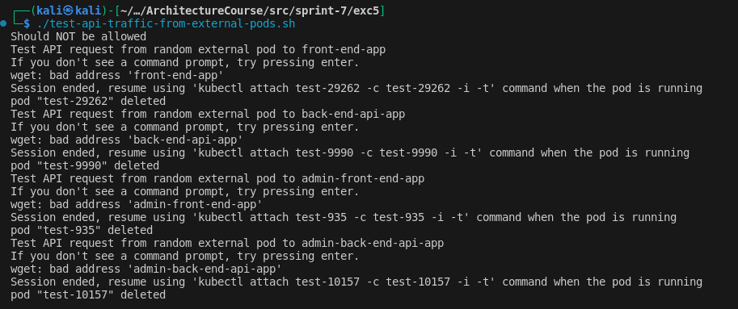

# Задание 5. Управление трафиком внутри кластера Kubertnetes

В этом задании вам нужно разграничить трафик между сервисами, которые развёрнуты в кластере Kubernetes:
- Вам необходимо добавить новый сервис. В терминах Kubernetes это под (pod). При этом нужно запретить другим подам с ним взаимодействовать.
- Необходимо изолировать трафик к новому сервису от других подов.

## Что нужно сделать

В кластере, внутри одного namespace, вам необходимо развернуть четыре сервиса. В качестве самого сервиса используйте образ Nginx (вам не нужно создавать логику приложения в этом заданий).
Назначьте метки для сервисов

Метки выполняют функцию ролей для сервиса:

1. front-end
2. back-end-api
3. admin-front-end
4. admin-back-end-api

Создайте сетевые политики

Настройте сетевые политики так, чтобы разделить трафик между сервисами API (admin-back-end-api, back-end-api) и сервисами, которые используют их UI (front-end, admin-front-end).

Таким образом, сетевые политики должны разрешить сетевой трафик в обе стороны между парой сервисов front-end и back-end-api, а также admin-front-end и admin-back-end-api.

Сохраните сетевую политику в файл. Можете назвать его non-admin-api-allow.yaml. Затем примените сетевую политику, используя команду:

```bash
kubectl apply -f non-admin-api-allow.yaml
```

Когда настроите и примените сетевые политики, проверьте, что трафик есть между сервисами, для которых он разрешён, но его нет между сервисами, для которых он запрещён. Для этого используйте команду:

```bash
kubectl run test-$RANDOM --rm -i -t --image=alpine -- sh
/ # wget -qO- --timeout=2 http://apiserver
```

## Решение

1. Создаем 4 сервиса

[Скрипт создания сервисов](./create-services.sh)




2. Создаем и применяем политики. Основная идея: сначала запретим любой трафик (Ingress/Egress) между всеми подами. Затем применим политики исключения для наших сервисов.

[Политика deny-all](./default-api-traffic.yaml)
[Политика non-admin-api](./non-admin-api-allow.yaml)
[Политика admin-api](./admin-api-allow.yaml)



3. Тестируем трафик

[Скрипт с разрешенным трафиком](./test-api-traffic-from-allowed-pods.sh)
[Скрипт с запрещенным трафиком](./test-api-traffic-from-external-pods.sh)



